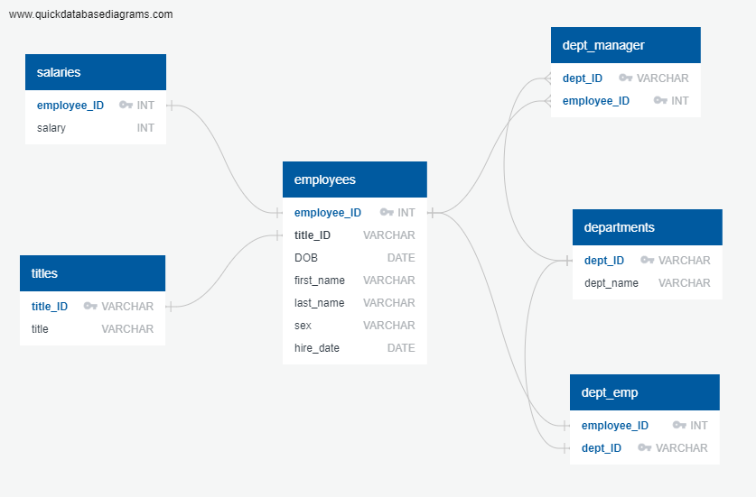

# PostgresSQL project to research about people whom a company employed during the 1980s and 1990s
##### *Inside of the EmployeeSQL directory are the SQL schema and queries scripts, as well as all of the data which is stored in CSVs in the data sub-directory* 

---
#### Directory structure:

EmployeeSQL/  
├─ queries.sql  
├─ schema.sql  
├─ ERD.png  
├─ data/  
│  ├─ departments.csv  
│  ├─ dept_emp.csv  
│  ├─ dept_manager.csv  
│  ├─ employees.csv  
│  ├─ salaries.csv  
│  ├─ titles.csv  
README.md  

---

